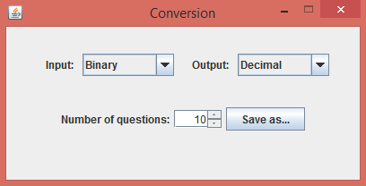

# ConversionQuiz
This was designed as a study tool for introductory computer science students to learn conversion between number systems: 
Binary, Hexadecimal, Octal, Decimal and BCD (Binary Coded Decimal).
The program generates two .txt files: one with a set amount of numbers in the "input" number system, and another where all of those are converted to the "output" number system.
It is run from ConversionQuiz.jar.

